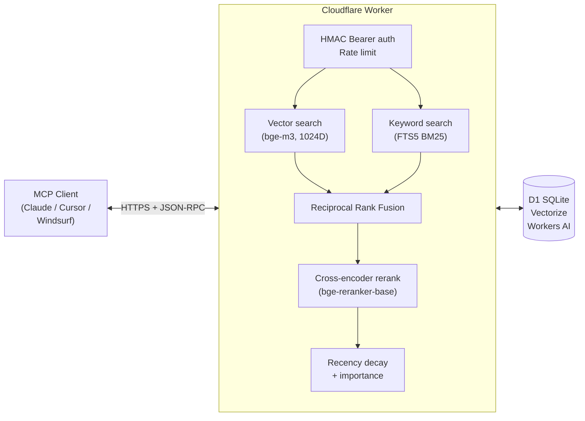

# Recall

[](./LICENSE)
[](./tsconfig.json)
[](https://workers.cloudflare.com)
[](https://modelcontextprotocol.io)
[](#quickstart-5-minutes)

**A self-hosted MCP memory server with hybrid semantic + keyword search, running on Cloudflare Workers.**

Give Claude, Cursor, Windsurf, or any MCP-compatible client a persistent memory that survives across sessions, projects, and devices. No SaaS, no per-token fees, no data leaving your infrastructure. Your Cloudflare account, your data, your rules.

**Who is this for?** Developers using AI coding assistants who are tired of re-explaining context every session. Teams who want a shared knowledge pool their agents can actually use. Anyone who wants memory without paying a subscription or shipping prompts to a third party.



## Why Recall?

Most MCP memory servers do one of two things: dump text into SQLite with cosine similarity, or call a hosted vector DB. Recall does both — at the same time — and reranks the combined results with a cross-encoder.

- **Hybrid search** — Vector similarity (bge-m3, 1024D) + BM25 full-text search, fused via Reciprocal Rank Fusion. Catches both semantic paraphrases and exact keyword matches.
- **Cross-encoder reranking** — Final candidates run through bge-reranker-base for precision. Content is truncated before reranking to keep AI token usage low.
- **Recency-weighted** — Fresh memories outrank stale ones via exponential decay, so your memory doesn't become a graveyard.
- **Deduplication guard** — Refuses to store memories with > 0.92 cosine similarity to existing entries under different keys.
- **Weekly consolidation** — A scheduled cron analyzes the store for near-duplicates and stale entries, writing a searchable report back into memory.
- **Hardened by default** — 1 MB body cap, constant-time HMAC auth, SHA-256 hashed rate-limit buckets, destructive tools default-disabled, weak-key warnings.
- **Serverless + cheap** — Runs on Cloudflare's free tier for most personal/small-team use. Sub-10ms cold start.

## How it compares

|                          | mem0   | letta  | zep    | Recall |
|--------------------------|:------:|:------:|:------:|:------:|
| MCP native               |   ✓    |   ✓    |   ✓    |   ✓    |
| Self-hostable            |   ✓    |   ✓    |   ✓    |   ✓    |
| Hybrid (vector + BM25)   |   ✗    |   ✗    |   ✓    |   ✓    |
| Cross-encoder reranking  |   ✗    |   ✗    |   ✗    |   ✓    |
| Recency decay            | partial| partial|   ✓    |   ✓    |
| Scheduled consolidation  |   ✗    |   ✗    |   ✗    |   ✓    |
| Deploy complexity        | docker | docker | docker | 1 command |
| Monthly cost (personal)  |  $0–$  |  $0–$  |  $0–$  |   $0   |

## Quickstart (5 minutes)

### Prerequisites

1. **A Cloudflare account** — free. [Sign up here](https://dash.cloudflare.com/sign-up). You do **not** need a custom domain. Cloudflare gives every worker a free `*.workers.dev` subdomain on signup, and Recall deploys to that by default. See [Custom domain (optional)](#custom-domain-optional) if you want a vanity URL.
2. **Workers AI access** — still free, but you must accept the terms once at [dash.cloudflare.com → AI → Workers AI](https://dash.cloudflare.com/?to=/:account/ai/workers-ai). First-time visit prompts you to agree. Without this, embeddings will fail.
3. **Node.js 20+** — [download here](https://nodejs.org) if you don't have it.

> **Total cost for personal use: $0.** Recall runs entirely within Cloudflare's free tier for Workers, D1, Vectorize, and Workers AI. See [Costs](#costs) for limits and real-world usage profiles.

### Deploy

```bash
git clone https://github.com/cashcon57/recall.git
cd recall
./setup.sh
```

The setup script will:

1. Log you in to Cloudflare if needed
2. Create a D1 database, apply the schema, and patch `wrangler.toml` with the generated ID
3. Create a Vectorize index (1024D, cosine) with metadata indexes on `importance` and `author`
4. Generate a cryptographically random `MEMORY_API_KEY` and upload it as a secret
5. Deploy the worker
6. Write the API key to a `chmod 600` file (`.recall-api-key`) so it doesn't land in your terminal scrollback

**Retrieve the key with** `cat .recall-api-key`, move it into a secret manager, then `rm .recall-api-key`.

## Add to your MCP client

### Claude Code (`.mcp.json`)

```json
{
  "mcpServers": {
    "recall": {
      "type": "http",
      "url": "https://your-worker.workers.dev/mcp",
      "headers": {
        "Authorization": "Bearer ${RECALL_API_KEY}"
      }
    }
  }
}
```

Export the key before launching Claude Code:

```bash
export RECALL_API_KEY=your-api-key-here
claude
```

### Claude Desktop (`claude_desktop_config.json`)

Claude Desktop doesn't currently support direct HTTP transports, so bridge it through `mcp-remote`:

```json
{
  "mcpServers": {
    "recall": {
      "command": "npx",
      "args": [
        "-y",
        "mcp-remote",
        "https://your-worker.workers.dev/mcp",
        "--header",
        "Authorization: Bearer your-api-key-here"
      ]
    }
  }
}
```

Config file locations:

- **macOS**: `~/Library/Application Support/Claude/claude_desktop_config.json`
- **Windows**: `%APPDATA%\Claude\claude_desktop_config.json`

### Cursor / Windsurf

Use the same HTTP config shape as Claude Code, in your editor's MCP config file. See your editor's docs for the exact path.

### Custom domain (optional)

The default `https://recall.<your-subdomain>.workers.dev/mcp` URL works perfectly and requires no domain. If you want a nicer URL like `https://memory.yourdomain.com/mcp`:

**Step 1 — Add your domain to Cloudflare** (if it's not already). Follow their [add-a-site flow](https://dash.cloudflare.com/?to=/:account/add-site). You'll update your registrar's nameservers — one-time DNS move.

**Step 2 — Add a route in `wrangler.toml`:**

```toml
[[routes]]
pattern = "memory.yourdomain.com/*"
zone_name = "yourdomain.com"
custom_domain = true
```

**Step 3 — Redeploy:** `npx wrangler deploy`. Cloudflare issues the TLS cert automatically.

## See it in action

Here's what using Recall looks like in practice. Say you're debugging a `citext` extension issue on Neon Postgres:

**Session 1 — You explain it once to Claude, Claude writes it down:**

> **You**: The auth migration is failing because we didn't install citext before adding the email column. Now Neon is rejecting the migration on the pooled connection.
>
> **Claude**: *[Calls `store_memory`]*
>
> ```json
> {
>   "key": "neon-citext-migration-order",
>   "content": "citext extension must be installed BEFORE creating columns of type citext. Pooled Neon connections silently reject the migration if the order is reversed. Run `CREATE EXTENSION citext;` in a separate migration, let it commit, then add the column in the next.",
>   "tags": ["database", "neon", "postgres", "migration", "gotcha"],
>   "importance": 0.85,
>   "author": "you"
> }
> ```
>
> Noted. I'll remember this for future migrations.

**Session 2 — Three weeks later, different project, Claude recalls it automatically:**

> **You**: I'm adding case-insensitive username lookup to the new service. Any gotchas?
>
> **Claude**: *[Calls `retrieve_memory` with query "case insensitive text columns postgres"]*
>
> Yes — there's a recorded gotcha from 3 weeks ago about citext on Neon. You need to install the extension in a separate migration BEFORE adding any citext columns, otherwise pooled connections silently reject the migration. Want me to structure the migration that way?

The memory is reranked by relevance, recency, and importance, so old-but-critical gotchas keep surfacing even as you accumulate thousands of entries.

## Tool reference

All tools are callable via the standard MCP `tools/call` method.

| Tool                   | Purpose |
|------------------------|---------|
| `store_memory`         | Save a memory under a unique key with tags, importance (0–1), and author. Auto-generates embedding. Refuses if a near-duplicate exists under a different key. |
| `retrieve_memory`      | Hybrid search (vector + BM25 → RRF → rerank → recency decay → importance). Returns top-N with combined scores. |
| `list_memories`        | Browse with pagination + filters (tag, author, limit, offset). Returns metadata only. |
| `delete_memory`        | Remove a memory by key from D1, FTS5, and Vectorize. |
| `clear_memories`       | Wipe everything. **Default-disabled** — requires both `confirm: true` AND the `ALLOW_DESTRUCTIVE_TOOLS=true` secret on the worker. See [Security](#security) for why. |
| `consolidate_memories` | Read-only analysis: flags similar memory pairs and stale entries. Returns a markdown report. |

### `store_memory` example

```json
{
  "name": "store_memory",
  "arguments": {
    "key": "postgres-migration-gotcha",
    "content": "The citext extension must be installed BEFORE creating columns of type citext, otherwise the migration silently fails on some pooled Neon connections.",
    "tags": ["database", "neon", "gotcha"],
    "importance": 0.8,
    "author": "alice"
  }
}
```

### `retrieve_memory` example

```json
{
  "name": "retrieve_memory",
  "arguments": {
    "query": "neon case insensitive text columns",
    "limit": 5,
    "min_importance": 0.5
  }
}
```

Results are ranked by:

- `0.5 × reranker_score` (bge-reranker-base, sigmoid-normalized)
- `0.3 × recency_decay` (exp(-0.001 × hours_since_last_access))
- `0.2 × importance` (author-assigned 0–1)

## Team usage

Recall works as a shared team memory with zero code changes. Everyone points at the same worker, passes the same API key, and distinguishes their contributions via the `author` field on each memory. Team retrieves default to the pooled store; personal focus comes from filtering by author.

**Important:** there is one API key. Teammates can read, overwrite, and delete each other's memories — author is a convention, not access control. Don't store secrets.

See [`TEAM_USAGE.md`](./TEAM_USAGE.md) for full team setup, conventions, privacy tradeoffs, and per-project `CLAUDE.md` templates your agents can follow.

## Architecture

### Storage layers

- **D1 (SQLite)** — canonical memory rows (id, key, content, tags, importance, author, timestamps, access count)
- **D1 FTS5** — virtual table with `porter unicode61` tokenizer for BM25 keyword search
- **Vectorize** — 1024D cosine index keyed by memory `key`, with metadata for `importance`, `author`, `tags`

### Search pipeline

1. Generate query embedding via Workers AI `@cf/baai/bge-m3`
2. In parallel: Vectorize top-40 + FTS5 top-40
3. **Reciprocal Rank Fusion** merges both lists with `K = 60`
4. Fetch top-20 full rows from D1
5. Apply post-query tag filter (D1 lacks JSON array ops)
6. **Rerank** with `@cf/baai/bge-reranker-base` (content truncated to 512 chars — 10-50x token savings)
7. Combine reranker + recency decay + importance into final score
8. Update `accessed_at` / `access_count` for returned results, debounced to 1 hour

### Write pipeline

`store_memory` runs the D1 insert, FTS5 sync, and Vectorize upsert in parallel — independent operations, roughly 2x faster than sequential.

### Cron consolidation

Runs every Sunday at 03:00 UTC by default (`0 3 * * SUN`). Scans up to 200 memories, finds pairs above `similarity_threshold` (default 0.82) and entries with zero accesses older than `stale_days` (default 60). Stores a markdown report as a searchable memory under the key `_system.consolidation-report`. **Never modifies or deletes memories automatically** — the report is a recommendation for humans or agents to act on.

Tune the schedule in [`wrangler.toml.example`](./wrangler.toml.example) `[triggers]` section.

## Security

- **Bearer auth** on `/mcp`, HMAC-SHA256 constant-time compare (no timing side channels)
- **Rate limit** 60 req/min, keyed off a SHA-256 hash of the full API key (not a prefix — prevents collision between keys with similar starts)
- **Payload size cap** 1 MB enforced via streaming reader (not Content-Length alone — survives lying clients)
- **Destructive tools default-disabled** — `clear_memories` requires explicit `ALLOW_DESTRUCTIVE_TOOLS=true` secret. A leaked API key cannot wipe your store in one call.
- **Weak key warning** — logs a warning if `MEMORY_API_KEY` is under 32 chars; returns HTTP 503 if missing entirely
- **Minimal /health** — unauthenticated health check returns `{ status: 'ok' }` only. No version or service name leak.
- **Input validation** with strict length + character limits on every field
- **FTS5 injection safe** — special characters stripped before query
- **No session state** — each request is independent
- **No CORS** — MCP clients are not browsers; don't add CORS unless you're building a web UI

For the full threat model, hardening checklist, and vulnerability disclosure process, see [`SECURITY.md`](./SECURITY.md).

## Managing secrets

Recall uses one secret — `MEMORY_API_KEY` — to authenticate MCP clients. The setup script handles it automatically on first deploy. For rotation, multi-environment setups, and local dev, the common commands are:

```bash
# Set (prompts for value — does NOT appear in shell history)
npx wrangler secret put MEMORY_API_KEY

# List (shows names only; values are unrecoverable after set)
npx wrangler secret list

# Delete
npx wrangler secret delete MEMORY_API_KEY

# Rotate: generate new key, push to worker, update all clients
NEW_KEY=$(openssl rand -hex 32)
echo "$NEW_KEY" | npx wrangler secret put MEMORY_API_KEY
# (Old key stops working immediately; coordinate with clients.)
```

**Local dev** (for `wrangler dev`) reads secrets from `.dev.vars`, which is git-ignored by default:

```bash
# .dev.vars
MEMORY_API_KEY=local-dev-key-doesnt-need-to-be-secure
```

**Multiple environments** (`--env staging`, `--env production`) each have separate secret stores. Add `[env.staging]` blocks to `wrangler.toml` and use `wrangler secret put MEMORY_API_KEY --env staging`.

**Where secrets live:** Deployed secrets are encrypted by Cloudflare, injected as env vars at runtime, never visible in the dashboard, API, or `wrangler tail`. `.dev.vars` is plaintext on your disk, never uploaded. Secrets never belong in `wrangler.toml`, git, or `console.log`.

If you accidentally commit a secret, rotate it immediately and treat the old value as compromised.

## Development

```bash
npm install
npm run dev        # Local dev with wrangler (remote bindings)
npm run typecheck  # TypeScript strict mode
npm run tail       # Stream production logs
```

### Repository layout

```text
recall/
├── src/
│   ├── index.ts      # Worker fetch + scheduled handler, rate limit, auth
│   ├── mcp.ts        # JSON-RPC 2.0 / MCP protocol dispatcher
│   ├── tools.ts      # 6 tool implementations + search pipeline + consolidation
│   ├── auth.ts       # Constant-time HMAC-SHA256 API key verify
│   └── types.ts      # Env bindings + domain + JSON-RPC types
├── schema.sql        # D1 table + indexes + FTS5 virtual table
├── wrangler.toml.example
├── setup.sh          # One-command Cloudflare deploy
└── examples/         # Sample MCP client configs, agent CLAUDE.md template
```

### Customization ideas

- **Change scoring weights** — edit `combinedScore` in `src/tools.ts:retrieveMemory`
- **Swap embedding model** — replace `@cf/baai/bge-m3` with any Workers AI embedding model, update dimensions in `wrangler.toml` and recreate the Vectorize index
- **Adjust rate limit** — `RATE_LIMIT_PER_MIN` constant in `src/index.ts`
- **Add a tool** — append to `TOOL_DEFINITIONS` and `executeTool` dispatch in `src/tools.ts`

## Costs

**TL;DR: $0/month for 95% of users.** Recall is designed to fit inside Cloudflare's free tier for personal and small-team use.

### Cloudflare free-tier limits (the resources Recall touches)

| Resource    | Free tier / day                         | What Recall uses per call                              |
|-------------|-----------------------------------------|---------------------------------------------------------|
| Workers     | 100,000 requests                        | 1 request per tool call                                 |
| D1          | 5M reads, 100K writes, 5GB storage      | ~1–3 reads, 1–3 writes per store; ~2 reads per retrieve |
| Vectorize   | 30M queried dims/day, 5M stored vectors | 1024 dims per query, 1024 dims per stored memory        |
| Workers AI  | 10,000 neurons/day                      | ~2–6 neurons per embedding, ~4 per rerank               |

Neurons are Cloudflare's AI billing unit. Roughly: one embedding via `bge-m3` ≈ 2–6 neurons, one rerank pass ≈ 4 neurons.

<details>
<summary><strong>Real-world usage profiles</strong> (click to expand)</summary>

These are honest estimates, not marketing math.

**Profile 1 — Solo dev, casual use**
~20 stores + 50 retrieves/day → ~340 neurons/day → **$0/mo** ✓

**Profile 2 — Active solo dev + Claude Code all day**
~50 stores + 300 retrieves/day → ~2,300 neurons/day → **$0/mo** ✓

**Profile 3 — 5-person team sharing one instance**
~100 stores + 1,000 retrieves/day → ~7,500 neurons/day → **$0/mo** ✓ (comfortably within free tier)

**Profile 4 — Heavy team or automated agent fleet**
~500 stores + 5,000 retrieves/day → ~40,000 neurons/day → **~$3–5/month**. You've blown through the daily neurons free tier. Everything else is still free. Workers AI overage is $0.011 per 1,000 neurons, so 30K/day × 30 days ≈ $10 worst case.

**Profile 5 — Ludicrous (10K+ retrieves/day)**
~$20–50/month. Workers AI becomes the dominant cost. Consider: lowering `candidateCount` from 20 to 10, caching embeddings client-side for repeat queries, or swapping to `@cf/baai/bge-small-en-v1.5` (384D) if you don't need multilingual.

</details>

**The cost nobody mentions**: Cloudflare's free tier is per-account, not per-worker. If you already use D1, Vectorize, or Workers AI for other projects, Recall's usage adds to the same daily counters. Usually not a problem, but worth knowing.

**No hosted tier, no subscription.** You are the host.

## FAQ

**Do I need a domain?**
No. Cloudflare gives every worker a free `*.workers.dev` subdomain. A custom domain is purely cosmetic.

**Do I need to pay Cloudflare?**
No, for typical personal and small-team use. See [Costs](#costs).

**How does this compare to Anthropic's built-in memory?**
Recall is self-hosted, works with any MCP client (not just Claude.ai), supports teams with a shared instance, and uses a richer retrieval pipeline (hybrid search + cross-encoder reranker). Anthropic's memory is simpler and tied to their platform. Use whichever fits.

**Can I use it without Claude?**
Yes. Any MCP-compatible client works — Cursor, Windsurf, Cline, your own code via the MCP TypeScript/Python SDK.

**What happens if Cloudflare goes down?**
Your memories are unavailable until it comes back up. D1 is replicated within Cloudflare's storage layer, so durability is high, but availability is tied to CF. For true HA you'd need to replicate across providers — Recall doesn't do this out of the box.

**Can I export my memories?**
Yes. `npx wrangler d1 export recall --output=backup.sql`. This gives you a SQLite dump you can import elsewhere.

**What embedding model is best for non-English?**
`bge-m3` (the default) is multilingual and works well for most languages. If you only need English, `bge-small-en-v1.5` is smaller and cheaper — swap it in `src/tools.ts` and recreate the Vectorize index with dimension 384.

**Can I run Recall outside Cloudflare Workers?**
Not directly — it uses CF-specific bindings (D1, Vectorize, Workers AI). Porting to a Node/Bun runtime with Postgres + pgvector + a local embedding model is possible but a non-trivial rewrite. PRs welcome if you do it.

**Is this production-ready?**
For personal and small-team use, yes. For mission-critical multi-tenant SaaS, no — Recall is single-tenant by design and has no per-user access control. See [`SECURITY.md`](./SECURITY.md) for the full threat model.

**How do I delete a single memory?**
`delete_memory` with the key. The full store wipe (`clear_memories`) is default-disabled to prevent accidental/malicious bulk deletion.

## Troubleshooting

**`wrangler: command not found`**
The setup script uses `npx wrangler`, so you shouldn't need a global install. If you hit this, run `npm install` first.

**Schema apply hangs**
D1 `--remote` applies can take a few seconds. If it hangs >30s, cancel and retry — Cloudflare API occasionally throttles new accounts.

**`Embedding generation returned no data`**
Workers AI throws this when the account isn't subscribed to the AI product. Visit `dash.cloudflare.com → AI → Workers AI` and accept the terms once.

**Vectorize dimension mismatch**
If you change embedding models, you must delete and recreate the Vectorize index with the new dimension count. Existing vectors won't survive.

**MCP client says `connection failed`**
Check: (1) the URL ends in `/mcp`, (2) the `Authorization: Bearer` header is present, (3) your API key matches what `wrangler secret list` shows, (4) the worker is deployed (`wrangler tail` to confirm).

**`clear_memories` returns "disabled"**
This is intentional. Set the secret to enable temporarily, then remove it:
```bash
echo "true" | npx wrangler secret put ALLOW_DESTRUCTIVE_TOOLS
# ... run clear_memories ...
npx wrangler secret delete ALLOW_DESTRUCTIVE_TOOLS
```

## Contributing

PRs welcome. Keep scope tight: this is infrastructure, not a framework. Changes should preserve:

- Zero external runtime dependencies beyond Cloudflare bindings
- Stateless request handling
- Constant-time auth
- Single-file-per-concern layout

File issues for bugs, feature discussions, or architectural questions.

For security issues, see [`SECURITY.md`](./SECURITY.md).

## License

MIT. See [LICENSE](./LICENSE).

## Credits

Recall was extracted from a private memory server built for real production use. The hybrid search + reranker + recency decay pipeline turned out to generalize well, so here it is. Cloudflare's `bge-m3` and `bge-reranker-base` models do most of the heavy lifting — credit to the BAAI team for building them and to Cloudflare for making them free on Workers AI.
