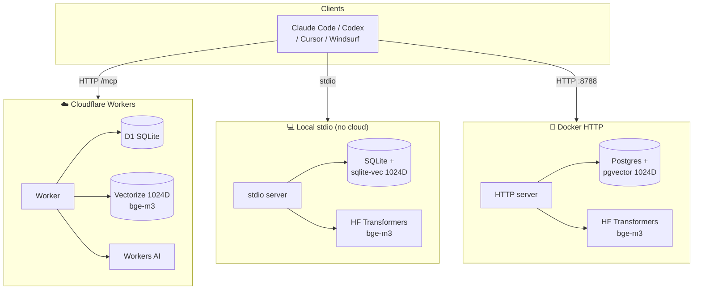

# Recall

[](https://github.com/cashcon57/recall/releases/latest)
[](https://github.com/cashcon57/recall/actions/workflows/ci.yml)
[](./LICENSE)
[](./tsconfig.json)
[](https://workers.cloudflare.com)
[](https://modelcontextprotocol.io)
[](#deployment-options)
[](https://ko-fi.com/cash508287)

**A self-hosted MCP memory server with hybrid semantic + keyword search. Deploy to Cloudflare Workers, run locally without any cloud dependencies, or self-host with Docker.**

> Not affiliated with Microsoft Windows Recall. This is an open-source memory server for AI coding assistants (Claude Code, Cursor, Windsurf, Cline, Claude Desktop, anything speaking MCP).

Give Claude, Cursor, Windsurf, or any MCP-compatible client a persistent memory that survives across sessions, projects, and devices. No SaaS, no per-token fees, no data leaving your infrastructure. Your Cloudflare account, your data, your rules.

**Who is this for?** Developers using AI coding assistants who are tired of re-explaining context every session. Teams who want a shared knowledge pool their agents can actually use. Anyone who wants memory without paying a subscription or shipping prompts to a third party.



## Deployment Options

Three backends. Same tool surface. Choose what fits your infra:

| | Cloudflare Workers | Local stdio | Docker HTTP |
|---|---|---|---|
| **Infrastructure** | CF D1 + Vectorize + Workers AI | SQLite + sqlite-vec | Postgres + pgvector |
| **Embeddings** | bge-m3, 1024D | bge-m3, 1024D | bge-m3, 1024D |
| **Internet required** | Yes | No | No |
| **MCP transport** | HTTP | stdio | HTTP |
| **Cost** | Free tier | Free | Free |
| **Best for** | Production, team sharing | Offline, privacy-first | Self-hosted server |

> **Memory portability between backends:** All three backends use the bge-m3 model (1024D embeddings). Local and Docker backends run the [Xenova ONNX export](https://huggingface.co/Xenova/bge-m3) with CLS pooling to match the reference recipe. Vector compatibility across backends is close in practice — semantic search works cross-backend — but exact bit-for-bit portability is not yet verified with an end-to-end smoke test. If strict portability matters, test your workload before migrating.

## Why Recall?

Most MCP memory servers do one of two things: dump text into SQLite with cosine similarity, or call a hosted vector DB. Recall does both — at the same time — and reranks the combined results with a cross-encoder.

- **Hybrid search** — Vector similarity (bge-m3, 1024D) + BM25 full-text search, fused via Reciprocal Rank Fusion. Catches both semantic paraphrases and exact keyword matches.
- **Cross-encoder reranking** — Final candidates run through bge-reranker-base for precision. Content is truncated before reranking to keep AI token usage low.
- **Tiered recency decay** — Three memory tiers with biological half-lives: `episodic` (7d, session events), `semantic` (69d, facts/concepts), `procedural` (693d, stable rules/credentials). Episodic context ages out fast; architecture decisions stay relevant for years. Tier design inspired by [NornicDB](https://github.com/orneryd/NornicDB).
- **Auto-relationship graph** — Memories with embedding similarity > 0.82 are automatically linked on store. Traverse with `get_related_memories` to find contextually adjacent knowledge without re-querying.
- **Deduplication guard** — Refuses to store memories with > 0.92 cosine similarity to existing entries under different keys.
- **Weekly consolidation** — A scheduled cron analyzes the store for near-duplicates and stale entries, writing a searchable report back into memory.
- **Hardened by default** — 1 MB body cap, constant-time HMAC auth, SHA-256 hashed rate-limit buckets, destructive tools default-disabled, weak-key warnings.
- **Serverless + cheap** — Runs on Cloudflare's free tier for most personal/small-team use. Sub-10ms cold start.

## How it compares

|                          | mem0   | letta  | zep    | Recall |
|--------------------------|:------:|:------:|:------:|:------:|
| MCP native               |   ✓    |   ✓    |   ✓    |   ✓    |
| Self-hostable            |   ✓    |   ✓    |   ✓    |   ✓    |
| Hybrid (vector + BM25)   |   ✗    |   ✗    |   ✓    |   ✓    |
| Cross-encoder reranking  |   ✗    |   ✗    |   ✗    |   ✓    |
| Recency decay            | partial| partial|   ✓    |   ✓    |
| Scheduled consolidation  |   ✗    |   ✗    |   ✗    |   ✓    |
| Deploy complexity        | docker | docker | docker | 1 command |
| Monthly cost (personal)  |  $0–$  |  $0–$  |  $0–$  |   $0   |

## Quickstart — Cloudflare Workers

### Prerequisites

1. **A Cloudflare account** — free. [Sign up here](https://dash.cloudflare.com/sign-up). You do **not** need a custom domain. Cloudflare gives every worker a free `*.workers.dev` subdomain on signup, and Recall deploys to that by default. See [Custom domain (optional)](#custom-domain-optional) if you want a vanity URL.
2. **Workers AI access** — still free, but you must accept the terms once at [dash.cloudflare.com → AI → Workers AI](https://dash.cloudflare.com/?to=/:account/ai/workers-ai). First-time visit prompts you to agree. Without this, embeddings will fail.
3. **Node.js 20+** — [download here](https://nodejs.org) if you don't have it.

> **Total cost for personal use: $0.** Recall runs entirely within Cloudflare's free tier for Workers, D1, Vectorize, and Workers AI. See [Costs](#costs) for limits and real-world usage profiles.

### Deploy

**The easiest way: paste this into Claude Code.**

```text
Fetch https://raw.githubusercontent.com/cashcon57/recall/v1.1.3/SETUP_PROMPTS.md using Bash (curl -fsSL) so you get the raw markdown, not a summary. Verify it contains a section titled "Prompt 0 — First-time setup". Execute that section verbatim, step by step, adapted and optimized for my current project. Do not summarize. Do not skip. If the fetch fails or the section is missing, stop and tell me.
```

Claude becomes the setup wizard: inspects your project, checks your environment, walks you through Cloudflare signup if you don't have an account, handles the Workers AI terms page, deploys the worker tuned for how you actually work, wires Recall into your MCP client config, and runs a full functional smoke test (hybrid search, reranker, security gates, auth). It asks how you want to organize memory across your projects before touching anything, so a solo dev with one repo and a team with ten repos get different setups tailored to them. At the end, it prints a report showing exactly how your install was adapted.

No reading required. No copy-pasting commands. The command is pinned to the `v1.1.3` release tag so it behaves identically every time.

Want to read what Claude will actually do? See [`SETUP_PROMPTS.md`](./SETUP_PROMPTS.md) — including a short "Why is the one-liner written that way?" explainer covering the four levers (pinning, explicit tool, integrity check, verbatim execution) that make the command deterministic.

**Prefer to run the script yourself?**

```bash
git clone https://github.com/cashcon57/recall.git
cd recall
./setup.sh
```

### What the setup actually does (either path)

1. Log you in to Cloudflare if needed
2. Create a D1 database, apply the schema, and patch `wrangler.toml` with the generated ID
3. Create a Vectorize index (1024D, cosine) with metadata indexes on `importance` and `author`
4. Generate a cryptographically random `MEMORY_API_KEY` and upload it as a secret
5. Deploy the worker
6. Write the API key to a `chmod 600` file (`.recall-api-key`) so it doesn't land in your terminal scrollback

**Retrieve the key with** `cat .recall-api-key`, move it into a secret manager, then `rm .recall-api-key`.

## Quickstart — Local stdio

No Cloudflare account needed. Runs fully offline after the first model download.

### Prerequisites

- Node.js 20+
- The `sqlite-vec` native extension for your platform ([releases](https://github.com/asg017/sqlite-vec/releases))

### Steps

```bash
# 1. Clone and enter the local directory
git clone https://github.com/cashcon57/recall && cd recall/local

# 2. Install dependencies
npm install

# 3. Build
npm run build

# 4. Download sqlite-vec extension for your platform
# macOS (Apple Silicon):
curl -L https://github.com/asg017/sqlite-vec/releases/latest/download/sqlite-vec-macos-arm64.tar.gz | tar xz
# macOS (Intel):
# curl -L https://github.com/asg017/sqlite-vec/releases/latest/download/sqlite-vec-macos-x86_64.tar.gz | tar xz
# Linux (x86_64):
# curl -L https://github.com/asg017/sqlite-vec/releases/latest/download/sqlite-vec-linux-x86_64.tar.gz | tar xz

# 5. Test
echo '{"jsonrpc":"2.0","id":1,"method":"initialize","params":{"protocolVersion":"2025-06-18","capabilities":{},"clientInfo":{"name":"test","version":"1"}}}' | \
  RECALL_DB_PATH=~/.recall/recall.db node dist/local/src/server.js
```

Add to your MCP client config (copy from `examples/mcp-config-local.json`):

```json
{
  "mcpServers": {
    "recall-local": {
      "command": "node",
      "args": ["/absolute/path/to/recall/local/dist/local/src/server.js"],
      "env": {
        "RECALL_DB_PATH": "/Users/<you>/.recall/recall.db",
        "SQLITE_VEC_PATH": "/absolute/path/to/recall/local/sqlite-vec"
      }
    }
  }
}
```

> **Note:** The first `retrieve_memory` or `store_memory` call downloads the bge-m3 model (~570MB) from HuggingFace. Subsequent calls use the local cache. better-sqlite3 appends the platform extension (`.dylib` / `.so`) to `SQLITE_VEC_PATH` automatically — omit the extension in the config.


## Quickstart — Docker

No Cloudflare account needed. Requires Docker and Docker Compose.

```bash
# 1. Clone
git clone https://github.com/cashcon57/recall && cd recall

# 2. Start Postgres + Recall server
cd docker
MEMORY_API_KEY=your-secret-key docker compose up -d

# 3. Verify
curl -s -X POST http://localhost:8788 \
  -H "Authorization: Bearer your-secret-key" \
  -H "Content-Type: application/json" \
  -d '{"jsonrpc":"2.0","id":1,"method":"tools/list","params":{}}' | jq '.result.tools | length'
# Expected: 7

# 4. Tear down (keeps data in pgdata volume)
docker compose down
```

Add to your MCP client config (copy from `examples/mcp-config-docker.json`):

```json
{
  "mcpServers": {
    "recall-docker": {
      "url": "http://localhost:8788",
      "headers": {
        "Authorization": "Bearer your-secret-key"
      }
    }
  }
}
```

## Add to your MCP client

### Claude Code (`.mcp.json`)

Create or edit `.mcp.json` in your project root with the actual worker URL and API key hardcoded (not env var substitution). **Gitignore this file** so the key stays local.

```json
{
  "mcpServers": {
    "recall": {
      "type": "http",
      "url": "https://your-worker.workers.dev/mcp",
      "headers": {
        "Authorization": "Bearer your-api-key-here"
      }
    }
  }
}
```

That's it. No `source .env`, no export, no shell setup. Claude Code reads `.mcp.json` on startup and connects automatically, just like every other MCP server.

### Claude Desktop (`claude_desktop_config.json`)

Claude Desktop doesn't currently support direct HTTP transports, so bridge it through `mcp-remote`:

```json
{
  "mcpServers": {
    "recall": {
      "command": "npx",
      "args": [
        "-y",
        "mcp-remote",
        "https://your-worker.workers.dev/mcp",
        "--header",
        "Authorization: Bearer your-api-key-here"
      ]
    }
  }
}
```

Config file locations:

- **macOS**: `~/Library/Application Support/Claude/claude_desktop_config.json`
- **Windows**: `%APPDATA%\Claude\claude_desktop_config.json`

### Cursor / Windsurf

Use the same HTTP config shape as Claude Code, in your editor's MCP config file. See your editor's docs for the exact path.

### Custom domain (optional)

The default `https://recall.<your-subdomain>.workers.dev/mcp` URL works perfectly and requires no domain. If you want a nicer URL like `https://memory.yourdomain.com/mcp`:

**Step 1 — Add your domain to Cloudflare** (if it's not already). Follow their [add-a-site flow](https://dash.cloudflare.com/?to=/:account/add-site). You'll update your registrar's nameservers — one-time DNS move.

**Step 2 — Add a route in `wrangler.toml`:**

```toml
[[routes]]
pattern = "memory.yourdomain.com/*"
zone_name = "yourdomain.com"
custom_domain = true
```

**Step 3 — Redeploy:** `npx wrangler deploy`. Cloudflare issues the TLS cert automatically.

## Claude Code vs Codex

Recall supports both Claude Code and Codex CLI. The session-start instructions differ slightly:

| Feature | Claude Code | Codex |
|---|---|---|
| Session instructions | `initialize` response `instructions` field | `AGENTS.md` in project root |
| Session config | `examples/CLAUDE.md` → copy to your project | `examples/AGENTS.md` → copy to your project |
| Context preservation | `examples/recall-precompact.sh` (PreCompact hook) | Manual — call `store_memory` before session ends |
| MCP config | `.mcp.json` with `mcpServers` | `.mcp.json` with `mcpServers` |
| Recommended backend | Any | CF Workers or Docker (HTTP transport) |

**Codex setup:** Copy `examples/AGENTS.md` to your project root (or append to your existing `AGENTS.md`).

## See it in action

Here's what using Recall looks like in practice. Say you're debugging a `citext` extension issue on Neon Postgres:

**Session 1 — You explain it once to Claude, Claude writes it down:**

> **You**: The auth migration is failing because we didn't install citext before adding the email column. Now Neon is rejecting the migration on the pooled connection.
>
> **Claude**: *[Calls `store_memory`]*
>
> ```json
> {
>   "key": "neon-citext-migration-order",
>   "content": "citext extension must be installed BEFORE creating columns of type citext. Pooled Neon connections silently reject the migration if the order is reversed. Run `CREATE EXTENSION citext;` in a separate migration, let it commit, then add the column in the next.",
>   "tags": ["database", "neon", "postgres", "migration", "gotcha"],
>   "importance": 0.85,
>   "author": "you"
> }
> ```
>
> Noted. I'll remember this for future migrations.

**Session 2 — Three weeks later, different project, Claude recalls it automatically:**

> **You**: I'm adding case-insensitive username lookup to the new service. Any gotchas?
>
> **Claude**: *[Calls `retrieve_memory` with query "case insensitive text columns postgres"]*
>
> Yes — there's a recorded gotcha from 3 weeks ago about citext on Neon. You need to install the extension in a separate migration BEFORE adding any citext columns, otherwise pooled connections silently reject the migration. Want me to structure the migration that way?

The memory is reranked by relevance, recency, and importance, so old-but-critical gotchas keep surfacing even as you accumulate thousands of entries.

## Tool reference

All tools are callable via the standard MCP `tools/call` method.

| Tool                   | Purpose |
|------------------------|---------|
| `store_memory`         | Save a memory under a unique key with tags, importance (0–1), author, and optional `namespace`. Auto-generates embedding. Refuses if a near-duplicate exists under a different key. |
| `retrieve_memory`      | Hybrid search (vector + BM25 → RRF → rerank → recency decay → importance). Returns top-N with combined scores. Optional `namespace` filter. |
| `list_memories`        | Browse with pagination + filters (tag, author, `namespace`, limit, offset). Returns metadata only. |
| `get_related_memories` | Traverse the auto-relationship graph from a given key. Returns related memories ranked by edge strength. |
| `delete_memory`        | Remove a memory by key from the store, FTS, and the vector index. |
| `clear_memories`       | Wipe everything. **Default-disabled** — requires both `confirm: true` AND the `ALLOW_DESTRUCTIVE_TOOLS=true` secret on the worker. See [Security](#security) for why. |
| `consolidate_memories` | Read-only analysis: flags similar memory pairs and stale entries. Returns a markdown report. |

### Namespaces (v2.1+)

Namespaces isolate memories per project or scope. A memory stored with `namespace: "project-alpha"` is only returned when the search/list call passes that same namespace. Memories stored without a namespace are global — they appear in un-filtered queries but are **excluded** when a namespace filter is active.

```json
{ "name": "store_memory", "arguments": {
  "key": "auth-flow", "content": "...", "author": "cash",
  "namespace": "project-alpha"
}}
```

```json
{ "name": "retrieve_memory", "arguments": {
  "query": "auth token expiry", "namespace": "project-alpha"
}}
```

Format: alphanumeric, hyphens, underscores, dots (same as `key`). Max 128 chars.

### `store_memory` example

```json
{
  "name": "store_memory",
  "arguments": {
    "key": "postgres-migration-gotcha",
    "content": "The citext extension must be installed BEFORE creating columns of type citext, otherwise the migration silently fails on some pooled Neon connections.",
    "tags": ["database", "neon", "gotcha"],
    "importance": 0.8,
    "author": "alice"
  }
}
```

### `retrieve_memory` example

```json
{
  "name": "retrieve_memory",
  "arguments": {
    "query": "neon case insensitive text columns",
    "limit": 5,
    "min_importance": 0.5
  }
}
```

Results are ranked by:

- `0.5 × reranker_score` (bge-reranker-base, sigmoid-normalized)
- `0.3 × recency_decay` (exp(-0.001 × hours_since_last_access))
- `0.2 × importance` (author-assigned 0–1)

## Team usage

Recall supports two team modes. The wizard in `SETUP_PROMPTS.md` lets you pick either during Phase 2 scoping.

### Mode 1: Shared pool (simple, no real privacy)

Everyone points at one worker, shares one API key, and distinguishes contributions via the `author` field on each memory. Team retrieves default to the pooled store; personal focus comes from filtering by author.

There is one API key. Teammates can read, overwrite, and delete each other's memories. **Author is a convention, not access control.** Don't store secrets. Don't store anything one teammate should keep private from another.

Good for: solo devs collaborating occasionally, small teams that trust each other completely, any setup where "everyone can see everything" is fine.

### Mode 2: Team + per-user personal pools (real privacy)

This is the **only option** that gives enforced privacy between teammates. Deploy two or more Recall instances on the same Cloudflare account:

- **One team instance**, shared by everyone. Same API key for all teammates. This is where shared knowledge lives (architecture, gotchas, decisions).
- **One personal instance per teammate.** Each teammate gets their own worker, their own D1 database, their own API key. Nobody else on the team can connect to it. This is where individual preferences live ("I like tabs", "my author handle is alice", "don't suggest emoji commits for me").

Each teammate's `.mcp.json` has **two server entries** — `recall-team` and `recall-personal` — with different URLs and different env vars. The team URL is the same for everyone; the personal URL differs per teammate. When Claude retrieves, it queries both servers and merges the results. Personal entries override team conventions for that user only.

This is the setup where "Alice tells Claude to do X and Bob tells Claude to do Y without conflicting" is actually true — because each personal pool is a literally different database with a different key.

**How to pick:** if you have collaborators and want real privacy for personal preferences, pick mode 2. Otherwise mode 1 is simpler and fine. Cost is the same either way ($0/month on Cloudflare's free tier for typical use).

See [`TEAM_USAGE.md`](./TEAM_USAGE.md) for full team setup, conventions, privacy tradeoffs, and per-project `CLAUDE.md` templates your agents can follow. The Claude Code setup wizard (via the one-liner at the top of this README) walks you through both modes interactively.

## Cleaning up CLAUDE.md and other memory files

Once Recall is connected, your existing `CLAUDE.md`, scattered `gotchas.md` / `notes.md` files, and built-in agent memory start duplicating what Recall can now do on demand. Cleanup is optional but recommended. Claude Code can do it for you in one shot.

### The division of responsibilities

**Keep in `CLAUDE.md`** (paid on every turn, so it should stay small):

- Always-on conventions ("use snake_case for DB columns", "components go in `src/components/`")
- Build, test, and deploy commands
- Hard rules the agent must never violate
- A one-paragraph project orientation

**Move to Recall** (paid only when relevant):

- Gotchas and bug root causes
- Architectural decisions and the *why* behind them
- "That time we fixed X by doing Y"
- Subtle API behavior that isn't in the docs
- Anything you'd write "the reason we do this is..." about

**Delete from both** (derivable from the code itself):

- File path lists, directory trees, function signatures
- "This project uses React 19.2 and TypeScript" (read `package.json`)
- Anything `git blame` or `grep` could answer

### The token math

A 4 KB `CLAUDE.md` costs about 1,000 tokens on every single turn. At 300 turns per day that's 300K tokens of `CLAUDE.md` you're paying for, most of it irrelevant to the current task. Shrinking to 1 KB of always-on rules and moving the situational 3 KB into Recall saves roughly 225K tokens per day. You lose nothing, because `retrieve_memory` surfaces the relevant entries when they actually matter.

### Prompt — have Claude do the cleanup for you

Paste this into Claude Code, running in the project you want to clean up:

```text
I just connected the `recall` MCP memory server to this project. I want you
to migrate my existing context files into Recall so I stop paying tokens on
stale context every turn. Do this carefully, one file at a time, and ask me
before deleting anything.

1. Verify `recall` is connected. Run /mcp or list_memories. If it's not
   connected, stop and tell me how to fix it before continuing.

2. Find all local context files in this repo and my home directory that
   might overlap with Recall:
   - CLAUDE.md (project root, any subdirectories, and ~/.claude/CLAUDE.md)
   - Any gotchas.md, notes.md, decisions.md, architecture.md, lessons.md,
     context.md, or similarly named files in the repo
   - ~/.claude/projects/<this-project>/memory/ if it exists
   List them and the size of each. Ask me to confirm the list before proceeding.

3. For each file, read it and categorize every section or bullet point into
   one of three buckets:

   a) KEEP IN CLAUDE.md — always-on conventions, build commands, hard rules,
      one-paragraph project orientation. Small, stable, applies to every turn.

   b) MOVE TO RECALL — gotchas, bug root causes, architectural decisions and
      their reasoning, "don't do X because Y" rules, subtle API behavior,
      past-tense stories. Situational.

   c) DELETE — derivable from the code (file paths, function signatures, tech
      stack lists), duplicated elsewhere, or stale.

4. Show me the categorization as a table or list BEFORE making any changes.
   Let me correct misclassifications. Do not touch any file until I approve
   the plan.

5. Once I approve:
   - For each MOVE TO RECALL item, call `store_memory` with a descriptive
     kebab-case key, appropriate tags (architecture, gotcha, decision, etc.),
     importance between 0.5 and 0.9 based on how load-bearing the info is,
     and author set to my handle (ask me what to use).
   - After each store_memory, tell me the key you used so I can track it.
   - Do NOT batch store_memory calls. One at a time so I can interrupt if
     something looks wrong.

6. Rewrite CLAUDE.md with only the KEEP items. Aim for under 1 KB if possible.
   Preserve any existing "Memory Usage (recall MCP server)" section at the
   bottom.

7. For files being fully deleted (gotchas.md etc.), show me a diff preview
   and ask for confirmation before `rm`.

8. Report the before/after CLAUDE.md size, the number of memories stored in
   Recall, and any files deleted. Estimate the tokens-per-turn saved.

Important rules:
- Never delete a file you haven't fully migrated first.
- Never store secrets in Recall (API keys, passwords, private keys). Skip
  those items and warn me if you see any in the source files.
- If an item could belong in both buckets (conventions with historical
  context), prefer CLAUDE.md if it's short and always-on, Recall if the
  historical context is the point.
- Skip `~/.claude/projects/<project>/memory/` for now. That's Claude Code's
  built-in per-project state and overlaps differently.
```

This is a destructive operation. Review the agent's categorization table before approving step 5. If you're nervous, start with a single file (e.g., just `gotchas.md`) and run the prompt repeatedly.

See [`SETUP_PROMPTS.md`](./SETUP_PROMPTS.md) for additional prompts covering deploy, agent wiring, and team onboarding.

## Architecture

### Storage layers

- **D1 (SQLite)** — canonical memory rows (id, key, content, tags, importance, author, timestamps, access count)
- **D1 FTS5** — virtual table with `porter unicode61` tokenizer for BM25 keyword search
- **Vectorize** — 1024D cosine index keyed by memory `key`, with metadata for `importance`, `author`, `tags`

### Search pipeline

1. Generate query embedding via Workers AI `@cf/baai/bge-m3`
2. In parallel: Vectorize top-40 + FTS5 top-40
3. **Reciprocal Rank Fusion** merges both lists with `K = 60`
4. Fetch top-20 full rows from D1
5. Apply post-query tag filter (D1 lacks JSON array ops)
6. **Rerank** with `@cf/baai/bge-reranker-base` (content truncated to 512 chars — 10-50x token savings)
7. Combine reranker + recency decay + importance into final score
8. Update `accessed_at` / `access_count` for returned results, debounced to 1 hour

### Write pipeline

`store_memory` runs the D1 insert, FTS5 sync, and Vectorize upsert in parallel — independent operations, roughly 2x faster than sequential.

### Cron consolidation

Runs every Sunday at 03:00 UTC by default (`0 3 * * SUN`). Scans up to 200 memories, finds pairs above `similarity_threshold` (default 0.82) and entries with zero accesses older than `stale_days` (default 60). Stores a markdown report as a searchable memory under the key `_system.consolidation-report`. **Never modifies or deletes memories automatically** — the report is a recommendation for humans or agents to act on.

Tune the schedule in [`wrangler.toml.example`](./wrangler.toml.example) `[triggers]` section.

### Backends

All three backends implement the same `RecallAdapter` interface (`src/adapter.ts`), exposing identical MCP tool surfaces. The differences are infrastructure and embedding model:

- **CloudflareAdapter** (`src/adapters/cloudflare.ts`) — wraps D1, Vectorize, Workers AI
- **LocalAdapter** (`local/src/adapter.ts`) — wraps better-sqlite3, sqlite-vec, HuggingFace Transformers
- **DockerAdapter** (`docker/src/adapter.ts`) — wraps Postgres/pgvector, HuggingFace Transformers

## Security

- **Bearer auth** on `/mcp`, HMAC-SHA256 constant-time compare (no timing side channels)
- **Rate limit** 60 req/min, keyed off a SHA-256 hash of the full API key (not a prefix — prevents collision between keys with similar starts)
- **Payload size cap** 1 MB enforced via streaming reader (not Content-Length alone — survives lying clients)
- **Destructive tools default-disabled** — `clear_memories` requires explicit `ALLOW_DESTRUCTIVE_TOOLS=true` secret. A leaked API key cannot wipe your store in one call.
- **Weak key warning** — logs a warning if `MEMORY_API_KEY` is under 32 chars; returns HTTP 503 if missing entirely
- **Minimal /health** — unauthenticated health check returns `{ status: 'ok' }` only. No version or service name leak.
- **Input validation** with strict length + character limits on every field
- **FTS5 injection safe** — special characters stripped before query
- **No session state** — each request is independent
- **No CORS** — MCP clients are not browsers; don't add CORS unless you're building a web UI

For the full threat model, hardening checklist, and vulnerability disclosure process, see [`SECURITY.md`](./SECURITY.md).

## Managing secrets

Recall uses one secret — `MEMORY_API_KEY` — to authenticate MCP clients. The setup script handles it automatically on first deploy. For rotation, multi-environment setups, and local dev, the common commands are:

```bash
# Set (prompts for value — does NOT appear in shell history)
npx wrangler secret put MEMORY_API_KEY

# List (shows names only; values are unrecoverable after set)
npx wrangler secret list

# Delete
npx wrangler secret delete MEMORY_API_KEY

# Rotate: generate new key, push to worker, update all clients
NEW_KEY=$(openssl rand -hex 32)
echo "$NEW_KEY" | npx wrangler secret put MEMORY_API_KEY
# (Old key stops working immediately; coordinate with clients.)
```

**Local dev** (for `wrangler dev`) reads secrets from `.dev.vars`, which is git-ignored by default:

```bash
# .dev.vars
MEMORY_API_KEY=local-dev-key-doesnt-need-to-be-secure
```

**Multiple environments** (`--env staging`, `--env production`) each have separate secret stores. Add `[env.staging]` blocks to `wrangler.toml` and use `wrangler secret put MEMORY_API_KEY --env staging`.

**Where secrets live:** Deployed secrets are encrypted by Cloudflare, injected as env vars at runtime, never visible in the dashboard, API, or `wrangler tail`. `.dev.vars` is plaintext on your disk, never uploaded. Secrets never belong in `wrangler.toml`, git, or `console.log`.

If you accidentally commit a secret, rotate it immediately and treat the old value as compromised.

## Development

```bash
npm install
npm run dev        # Local dev with wrangler (remote bindings)
npm run typecheck  # TypeScript strict mode
npm run tail       # Stream production logs
```

### Repository layout

```text
recall/
├── src/
│   ├── index.ts      # Worker fetch + scheduled handler, rate limit, auth
│   ├── mcp.ts        # JSON-RPC 2.0 / MCP protocol dispatcher
│   ├── tools.ts      # 6 tool implementations + search pipeline + consolidation
│   ├── auth.ts       # Constant-time HMAC-SHA256 API key verify
│   └── types.ts      # Env bindings + domain + JSON-RPC types
├── schema.sql        # D1 table + indexes + FTS5 virtual table
├── wrangler.toml.example
├── setup.sh          # One-command Cloudflare deploy
└── examples/         # Sample MCP client configs, agent CLAUDE.md template
```

### Customization ideas

- **Change scoring weights** — edit `combinedScore` in `src/tools.ts:retrieveMemory`
- **Swap embedding model** — replace `@cf/baai/bge-m3` with any Workers AI embedding model, update dimensions in `wrangler.toml` and recreate the Vectorize index
- **Adjust rate limit** — `RATE_LIMIT_PER_MIN` constant in `src/index.ts`
- **Add a tool** — append to `TOOL_DEFINITIONS` and `executeTool` dispatch in `src/tools.ts`

## Costs

**TL;DR: $0/month for 95% of users.** Recall is designed to fit inside Cloudflare's free tier for personal and small-team use.

### Cloudflare free-tier limits (the resources Recall touches)

| Resource    | Free tier / day                         | What Recall uses per call                              |
|-------------|-----------------------------------------|---------------------------------------------------------|
| Workers     | 100,000 requests                        | 1 request per tool call                                 |
| D1          | 5M reads, 100K writes, 5GB storage      | ~1–3 reads, 1–3 writes per store; ~2 reads per retrieve |
| Vectorize   | 30M queried dims/day, 5M stored vectors | 1024 dims per query, 1024 dims per stored memory        |
| Workers AI  | 10,000 neurons/day                      | ~2–6 neurons per embedding, ~4 per rerank               |

Neurons are Cloudflare's AI billing unit. Roughly: one embedding via `bge-m3` ≈ 2–6 neurons, one rerank pass ≈ 4 neurons.

<details>
<summary><strong>Real-world usage profiles</strong> (click to expand)</summary>

These are honest estimates, not marketing math.

**Profile 1 — Solo dev, casual use**
~20 stores + 50 retrieves/day → ~340 neurons/day → **$0/mo** ✓

**Profile 2 — Active solo dev + Claude Code all day**
~50 stores + 300 retrieves/day → ~2,300 neurons/day → **$0/mo** ✓

**Profile 3 — 5-person team sharing one instance**
~100 stores + 1,000 retrieves/day → ~7,500 neurons/day → **$0/mo** ✓ (comfortably within free tier)

**Profile 4 — Heavy team or automated agent fleet**
~500 stores + 5,000 retrieves/day → ~40,000 neurons/day → **~$3–5/month**. You've blown through the daily neurons free tier. Everything else is still free. Workers AI overage is $0.011 per 1,000 neurons, so 30K/day × 30 days ≈ $10 worst case.

**Profile 5 — Ludicrous (10K+ retrieves/day)**
~$20–50/month. Workers AI becomes the dominant cost. Consider: lowering `candidateCount` from 20 to 10, caching embeddings client-side for repeat queries, or swapping to `@cf/baai/bge-small-en-v1.5` (384D) if you don't need multilingual.

</details>

**The cost nobody mentions**: Cloudflare's free tier is per-account, not per-worker. If you already use D1, Vectorize, or Workers AI for other projects, Recall's usage adds to the same daily counters. Usually not a problem, but worth knowing.

**No hosted tier, no subscription.** You are the host.

## FAQ

**Do I need a domain?**
No. Cloudflare gives every worker a free `*.workers.dev` subdomain. A custom domain is purely cosmetic.

**Do I need to pay Cloudflare?**
No, for typical personal and small-team use. See [Costs](#costs).

**How does this compare to Anthropic's built-in memory?**
Recall is self-hosted, works with any MCP client (not just Claude.ai), supports teams with a shared instance, and uses a richer retrieval pipeline (hybrid search + cross-encoder reranker). Anthropic's memory is simpler and tied to their platform. Use whichever fits.

**Can I use it without Claude?**
Yes. Any MCP-compatible client works — Cursor, Windsurf, Cline, your own code via the MCP TypeScript/Python SDK.

**What happens if Cloudflare goes down?**
Your memories are unavailable until it comes back up. D1 is replicated within Cloudflare's storage layer, so durability is high, but availability is tied to CF. For true HA you'd need to replicate across providers — Recall doesn't do this out of the box.

**Can I export my memories?**
Yes. `npx wrangler d1 export recall --output=backup.sql`. This gives you a SQLite dump you can import elsewhere.

**What embedding model is best for non-English?**
`bge-m3` (the default) is multilingual and works well for most languages. If you only need English, `bge-small-en-v1.5` is smaller and cheaper — swap it in `src/tools.ts` and recreate the Vectorize index with dimension 384.

**Why Cloudflare as the default backend?**
Cloudflare gives Recall four things that matter: D1 (SQLite with FTS5 built in), Vectorize (managed 1024D index with metadata filters), Workers AI (free-tier `bge-m3` + `bge-reranker-base` embeddings and reranking), and Workers itself (sub-10ms cold start, generous free tier, no container to maintain). Putting all of that on one vendor is what makes it $0/month, one-command install, and zero ops for the 95% use case.

**Can I run Recall outside Cloudflare Workers?**
Yes, since v2.0.0. Two alternative backends ship in the same repo: a local stdio server (better-sqlite3 + sqlite-vec, fully offline) and a Docker HTTP server (Postgres + pgvector). All three backends implement the same `RecallAdapter` interface and expose the same MCP tool surface. See [Deployment Options](#deployment-options) for the matrix.

**But I'm still nervous about Cloudflare having my memories.**
Worth saying clearly: on the CF backend, Recall runs on YOUR Cloudflare account, not a shared service. The code is MIT, the worker is deployed under your own CF credentials, the D1 database lives in your account, the API key is yours, and the data never leaves your CF tenant. It's self-hosted in the same sense that running Postgres on AWS RDS is self-hosted — Cloudflare is the substrate, not the vendor you're sharing data with. If that's still not sufficient (auditability, compliance, or you just don't trust CF specifically), use the [local stdio](#quickstart--local-stdio) or [Docker](#quickstart--docker) backend — both run without any cloud dependencies.

**Is this production-ready?**
For personal and small-team use, yes. For mission-critical multi-tenant SaaS, no — each Recall instance is single-tenant by design and has no per-user access control within an instance. See [`SECURITY.md`](./SECURITY.md) for the full threat model.

**Can two teammates have different personal preferences without conflicting?**
Yes, with option F in the setup wizard: "team + per-user personal pool". Deploy one shared team instance plus one personal instance per teammate. Each personal instance has its own API key only that teammate has. Claude queries both servers on retrieve and merges the results. Personal preferences override team conventions for that user only. This is the only configuration where cross-teammate privacy is enforced by code, not convention. See the [Team usage](#team-usage) section above for full details, or just paste the one-line install prompt at the top of this README and pick option F when asked.

**How do I delete a single memory?**
`delete_memory` with the key. The full store wipe (`clear_memories`) is default-disabled to prevent accidental/malicious bulk deletion.

## Troubleshooting

**`wrangler: command not found`**
The setup script uses `npx wrangler`, so you shouldn't need a global install. If you hit this, run `npm install` first.

**Schema apply hangs**
D1 `--remote` applies can take a few seconds. If it hangs >30s, cancel and retry — Cloudflare API occasionally throttles new accounts.

**`Embedding generation returned no data`**
Workers AI throws this when the account isn't subscribed to the AI product. Visit `dash.cloudflare.com → AI → Workers AI` and accept the terms once.

**Vectorize dimension mismatch**
If you change embedding models, you must delete and recreate the Vectorize index with the new dimension count. Existing vectors won't survive.

**MCP client says `connection failed`**
Check: (1) the URL ends in `/mcp`, (2) the `Authorization: Bearer` header is present, (3) your API key matches what `wrangler secret list` shows, (4) the worker is deployed (`wrangler tail` to confirm).

**`clear_memories` returns "disabled"**
This is intentional. Set the secret to enable temporarily, then remove it:
```bash
echo "true" | npx wrangler secret put ALLOW_DESTRUCTIVE_TOOLS
# ... run clear_memories ...
npx wrangler secret delete ALLOW_DESTRUCTIVE_TOOLS
```

## Contributing

PRs welcome. Keep scope tight: this is infrastructure, not a framework. Changes should preserve:

- Zero external runtime dependencies beyond Cloudflare bindings
- Stateless request handling
- Constant-time auth
- Single-file-per-concern layout

File issues for bugs, feature discussions, or architectural questions.

For security issues, see [`SECURITY.md`](./SECURITY.md).

## Support Recall

Recall is free and always will be. If it saves you time and you feel like buying me a coffee, you can do that below. Completely optional, zero pressure — I'm not running a business here. The server is yours, the code is MIT, the coffee is strictly a "thanks if you want to" thing.

[](https://ko-fi.com/cash508287)

## License

MIT. See [LICENSE](./LICENSE).

## Credits

Recall was extracted from a private memory server built for real production use. The hybrid search + reranker + recency decay pipeline turned out to generalize well, so here it is.

### Models & embeddings

- **[BAAI](https://huggingface.co/BAAI)** — `bge-m3` (embeddings) and `bge-reranker-base` (cross-encoder). These do most of the heavy lifting.
- **[Xenova](https://huggingface.co/Xenova)** — maintains the ONNX export of bge-m3 that makes the local and Docker backends possible without Workers AI.
- **[Cloudflare](https://developers.cloudflare.com/workers-ai/)** — Workers AI runtime for hosting BAAI's models on the free tier.

### Architecture

- **[NornicDB](https://github.com/orneryd/NornicDB)** — tiered memory half-life design (episodic / semantic / procedural) and the auto-relationship graph pattern are ported from NornicDB's approach.
- **[Model Context Protocol](https://modelcontextprotocol.io)** — protocol spec by Anthropic.

### Multi-backend stack (v2.0.0)

- **[sqlite-vec](https://github.com/asg017/sqlite-vec)** (Alex Garcia) — SQLite vector extension powering the local backend.
- **[pgvector](https://github.com/pgvector/pgvector)** (Andrew Kane) — Postgres vector extension powering the Docker backend.
- **[better-sqlite3](https://github.com/WiseLibs/better-sqlite3)** (WiseLibs) — synchronous SQLite binding used by the local stdio server.
- **[@huggingface/transformers](https://github.com/huggingface/transformers.js)** (HuggingFace) — ONNX pipeline for running bge-m3 locally in Node.

### Dependencies

Full list in `package.json`, `local/package.json`, and `docker/package.json`.
